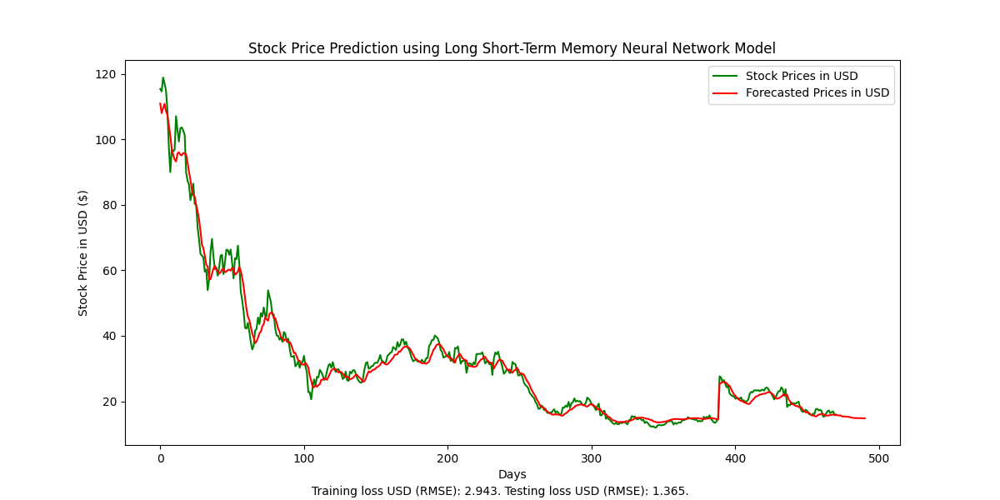
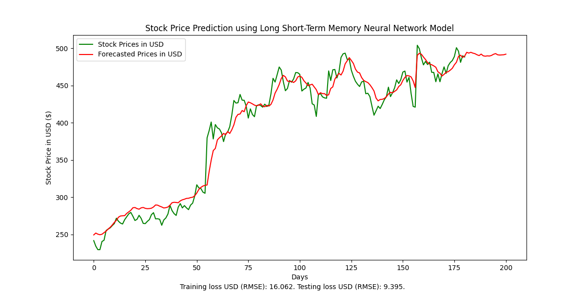

Machine learning Python project that takes advantage of neural network capabilities of the Tensorflow and Keras packages. Formats historic stock prices into time series data to train long short-term memory model. Predicts stock price movement 20 days into the future.

Techniques used for regression
- Utilizes "sliding window" technique which prepares stock price data to be used as input for the machine learning model (20 day sliding window)
- Learns from the first 80% of the actual historic stock movement as training data then tests its accuracy on the last 20% of the actual historic stock movement
- Training RMSE is based on the first 80% of the historic stock price data and the testing RMSE is based on the last 20% of the historic stock price data

Program features
- Is able to predict 20 days into the future
- Utilizes 50 neurons for fitting with a 20% dropout layer to prevent overfitting during training and testing
- Random seeds for NumPy and Tensorflow packages are stabilized and thus outputs are reproducable

Program limitations
- Univariate; program only considers stock movement rather than market news. Therefore, business deals and other market factors cannot be considered in this program
- Observed that beyond 20 days of prediction, program begins to overfit and becomes linear
- Any other data requires slight amounts of reformatting in order to be accepted by the program (i.e. unnecessary formatting must be removed other than column titles)

_Picture below reflects Rivian stock from IPO to Novemeber 23, 2023_

_Picture below reflects NVDA stock from February 7, 2023 to December 27, 2023_

