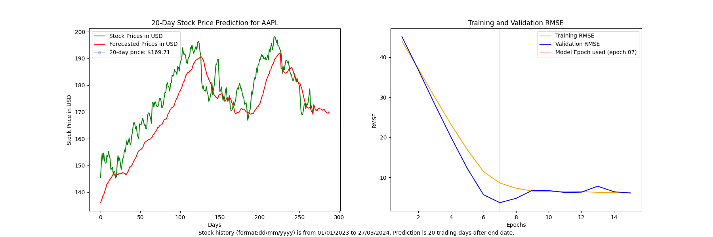
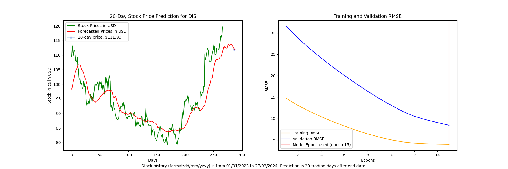
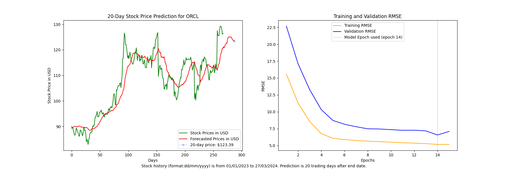
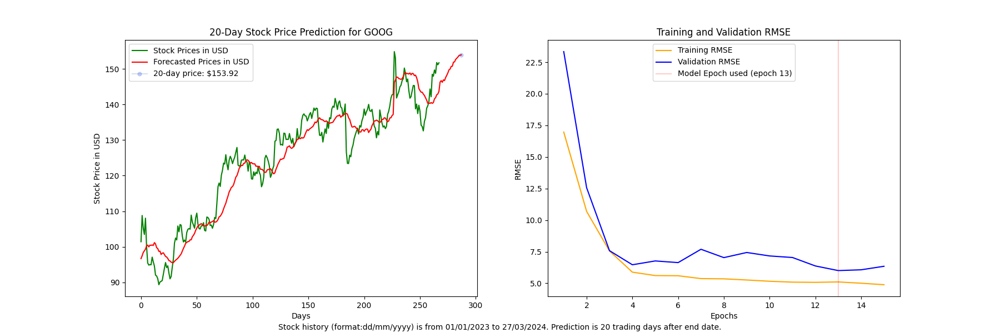

# StockForecaster

**Currently in Progress: Vercel deployment imminent as of Octoer 9, 2025**

## Description

StockForecaster is a full-stack stock price prediction platform that uses LSTM neural networks to forecast prices 20 days into the future. The project consists of a Python/TensorFlow backend deployed as a serverless AWS Lambda function, accessible via a public REST API with authentication and rate limiting, and a Next.js/TypeScript frontend (in development).

The machine learning model leverages TensorFlow and Keras to format historic stock prices into time series data for training a Long Short-Term Memory (LSTM) network. The model works best with predictions spanning 20 days and stock history of at least 1 year. Training uses 15 epochs with 64 batches each, following best practices from scientific literature to prevent overfitting.

### Technical Stack

**Backend:** Python 3.11, TensorFlow 2.15, AWS Lambda (Docker containerized), API Gateway, DynamoDB  
**Frontend:** Next.js 14, TypeScript (Tailwind), React (in development)  
**ML Model:** LSTM with 50 units, 20% dropout, custom weighted RMSE epoch selection  
**Features:** Async request/response pattern, VADER sentiment analysis, cold start retry logic

### API Endpoints

**POST /predict** - Submit prediction request (returns request_id immediately)  
**GET /status/{request_id}** - Poll for completion and retrieve results

Model training takes 2-4 minutes but uses async architecture to avoid API Gateway timeout limits.

---

## Reproducible results: Confirmation samples with accuracy score

Confirmation results following update of model epoch scoring formula (75% weighting on validation data)

### Disclaimer of Results

Data has been heavily cherrypicked. Forecasting works best on stable stocks with large amounts of historical data. All claims of MAPE and accuracy are backtesting accuracy results and not indicators of future performance.

### Apple (AAPL) Prediction (0.41% MAPE)

- Actual April 24, 2024 close: $169.02 USD (downtrend)
- Predicted April 24, 2024 close: $169.71 USD (predicted downtrend)
- Training and validation data spanning January 1, 2023 to March 27, 2024 (20 trading days before April 24)
- Model forecasted 20-day price accuracy: 99.59% (pre Q1-earnings)

### Disney (DIS) Prediction (1.75% MAPE)

- Actual April 24, 2024 close: $113.92 USD (downtrend)
- Predicted April 24, 2024 close: $111.93 USD (predicted downtrend)
- Training and validation data spanning January 1, 2023 to March 27, 2024 (20 trading days before April 24)
- Model forecasted 20-day price accuracy: 98.25% (post Q1-earnings)

### Oracle (ORCL) Prediction (6.98% MAPE)

- Actual April 24, 2024 close: $115.34 USD (downtrend)
- Predicted April 24, 2024 close: $123.39 USD (predicted downtrend)
- Training and validation data spanning January 1, 2023 to March 27, 2024 (20 trading days before April 24)
- Model forecasted 20-day price accuracy: 93.02% (post Q1-earnings)

### Alphabet/Google (GOOG) Prediction (4.46% MAPE)

- Actual April 24, 2024 close: $161.10 USD (uptrend)
- Predicted April 24, 2024 close: $153.92 USD (predicted uptrend)
- Training and validation data spanning January 1, 2023 to March 27, 2024 (20 trading days before April 24)
- Model forecasted 20-day price accuracy: 95.54% (pre Q1-earnings)

