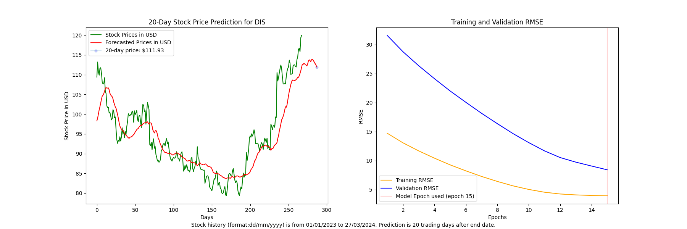
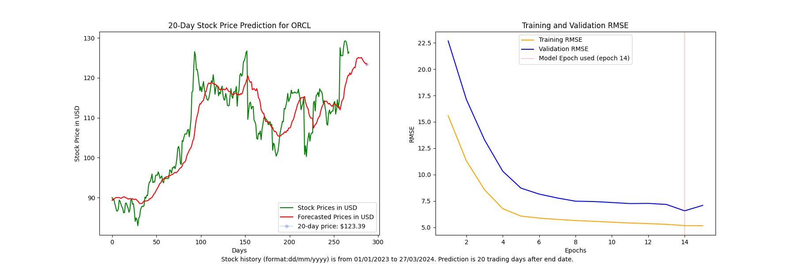

<h3>Description:</h3>
This machine learning Python project leverages the neural network capabilities of the TensorFlow and Keras packages.  It formats historic stock prices into time series data to train a long short-term memory (LSTM) model.  The model predicts stock price movements x amount of days into the future; it generally works best with predictions spanning 20 days and stock history spanning just over 1 year.  The model allows 15 epochs- with 64 batches each- of the entire data set, which, according to scientific literature found in https://www.geeksforgeeks.org, is enough to train the model and to prevent overfitting.

<h3>Citation:</h3>
Alvaro Bartolome del Canto. investpy - Financial Data Extraction from Investing.com with Python. 2018-2021. GitHub Repository. Available at: https://github.com/alvarobartt/investpy

<h1>Reproducible results: Confirmation samples with accuracy score</h1>
Confirmation results following update of model epoch scoring formula

<h3>Apple (AAPL) Prediction (99.59% Accuracy)</h3>
<ul>
  <li>Actual April 24, 2024 close: $169.02 USD (downtrend)</li>
  <li>Predicted April 24, 2024 close: $169.71 USD (predicted downtrend)</li>
  <li>Training and validation data spanning January 1, 2023 to March 27, 2023 (20 trading days before April 24)</li>
  <li>Model forecasted 20-day price accuracy: 99.59% (pre Q1-earnings)</li>
</ul>

<h3>Disney (DIS) Prediction (98.25% Accuracy)</h3>
<ul>
  <li>Actual April 24, 2024 close: $113.92 USD (downtrend)</li>
  <li>Predicted April 24, 2024 close: $111.93 USD (predicted downtrend)</li>
  <li>Training and validation data spanning January 1, 2023 to March 27, 2023 (20 trading days before April 24)</li>
  <li>Model forecasted 20-day price accuracy: 98.25% (post Q1-earnings)</li>
</ul>

<h3>Oracle (ORCL) Prediction (93.02% Accuracy)</h3>
<ul>
  <li>Actual April 24, 2024 close: $115.34 USD (downtrend)</li>
  <li>Predicted April 24, 2024 close: $123.39 USD (predicted downtrend)</li>
  <li>Training and validation data spanning January 1, 2023 to March 27, 2023 (20 trading days before April 24)</li>
  <li>Model forecasted 20-day price accuracy: 93.02% (post Q1-earnings)</li>
</ul>

<h3>Alphabet/Google (GOOG) Prediction (95.54% Accuracy)</h3>
<ul>
  <li>Actual April 24, 2024 close: $161.10 USD (uptrend)</li>
  <li>Predicted April 24, 2024 close: $153.92 USD (predicted uptrend)</li>
  <li>Training and validation data spanning January 1, 2023 to March 27, 2023 (20 trading days before April 24)</li>
  <li>Model forecasted 20-day price accuracy: 95.54% (pre Q1-earnings)</li>
</ul>

